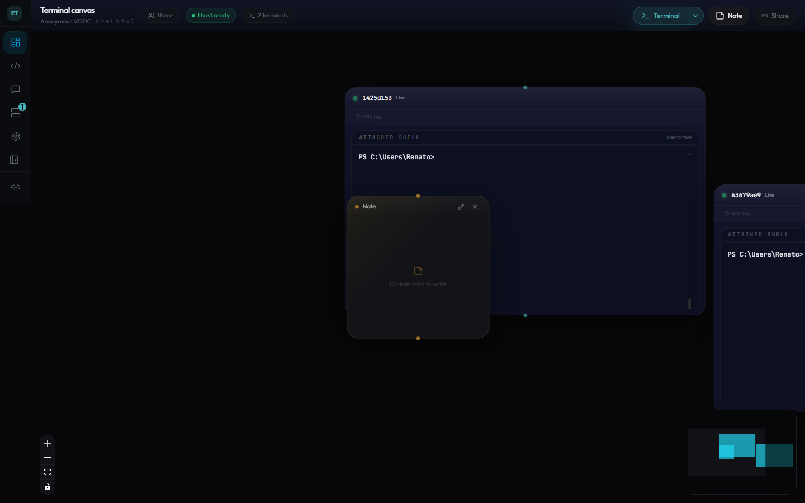
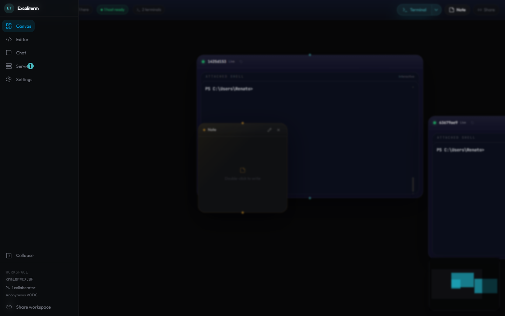
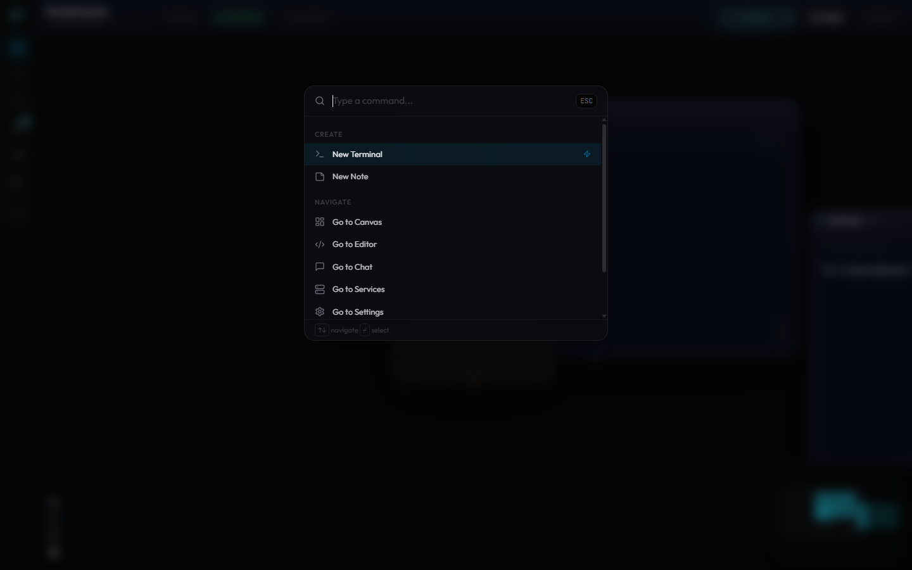
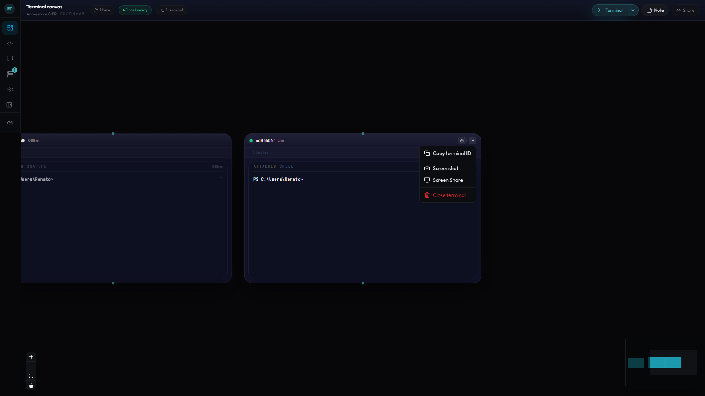
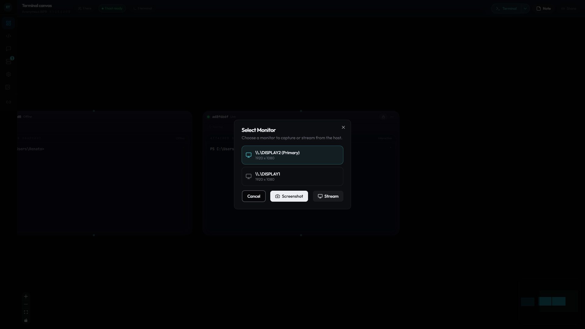
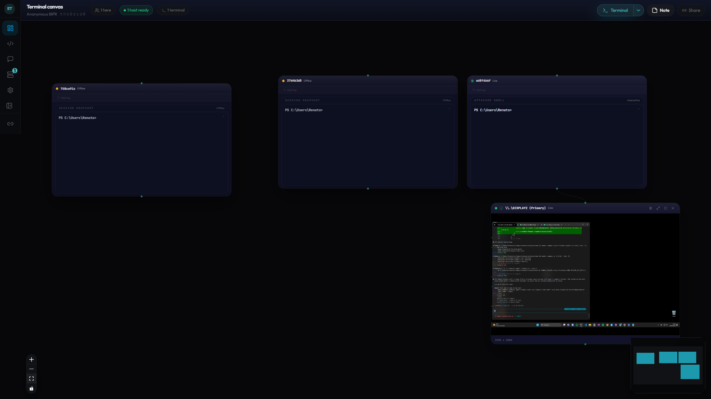
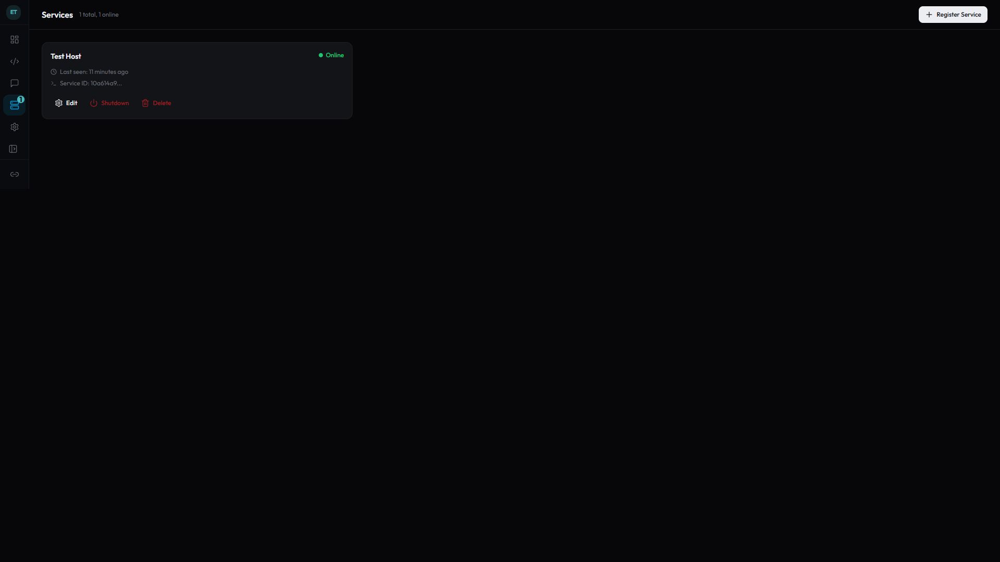
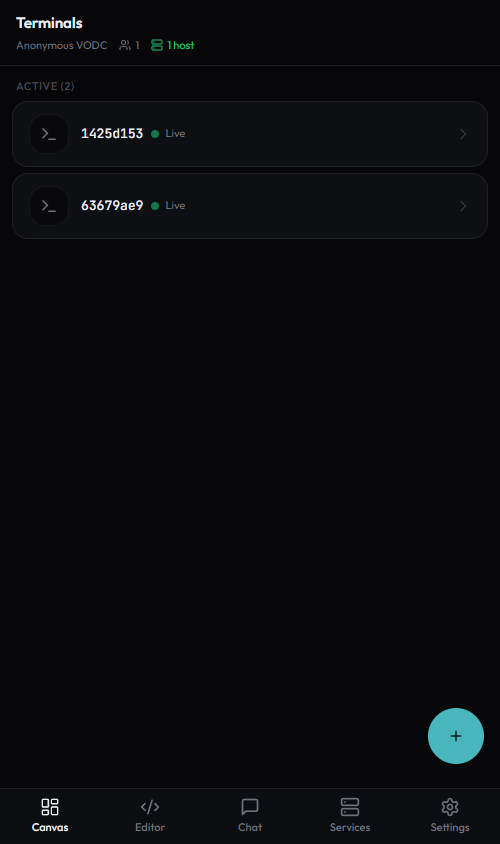
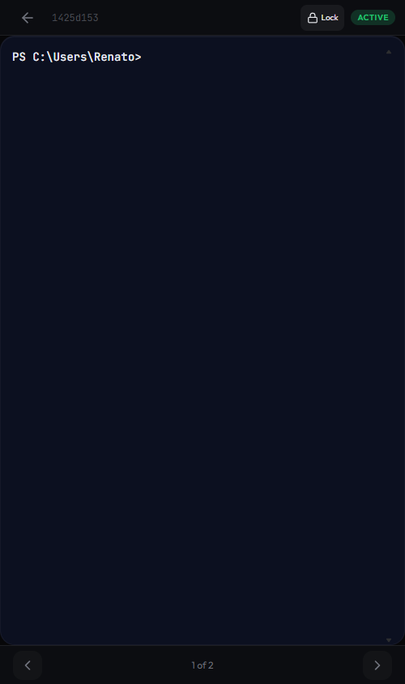

# Excaliterm

Collaborative terminal workspace with an infinite canvas UI, shared notes, chat, and file access.

[excaliterm.com](https://excaliterm.com) | [npm](https://www.npmjs.com/package/excaliterm)

## Screenshots

### Desktop

Infinite canvas with live terminals, sticky notes, and tag-based organization:



Pinned sidebar for quick navigation between Canvas, Editor, Chat, Services, and Settings:



Command palette for keyboard-driven workflows:



### Screen Share & Screenshots

Capture a screenshot or start a live screen share from any terminal's overflow menu:



Multi-monitor picker with resolution info -- choose which display to capture or stream:



Live screen share at ~3 fps streamed directly from the host, rendered as a canvas node connected to the source terminal:



### Host Management

Shut down a remote host directly from the Services page (only shown for online hosts):



### Mobile

Terminal list with live status indicators and one-tap access:

<p>
  
</p>

Fullscreen terminal with swipe navigation between sessions:

<p>
  
</p>

## Getting Started

### 1. Create a workspace

Go to [excaliterm.com](https://excaliterm.com) -- a workspace is created automatically. Copy the **workspace ID** from the URL (`/w/<id>`).

### 2. Connect a host

In the canvas toolbar, click **Connect a Host**. The dialog shows the full connection command with the workspace API key and hub URL pre-filled. Copy it.

### 3. Install the CLI

```bash
npm install -g excaliterm
```

Requires [Node.js](https://nodejs.org/) 18 or later.

### 4. Connect your machine

Paste the command from the "Connect a Host" dialog, or set the environment variables manually:

**Linux / macOS:**

```bash
export SIGNALR_HUB_URL="<hub URL>"
export SERVICE_API_KEY="<workspace API key>"
export WORKSPACE_ID="<workspace ID from URL>"
excaliterm
```

**Windows (PowerShell):**

```powershell
$env:SIGNALR_HUB_URL = "<hub URL>"
$env:SERVICE_API_KEY = "<workspace API key>"
$env:WORKSPACE_ID = "<workspace ID from URL>"
excaliterm
```

The API key is auto-generated per workspace. You can find it any time in the "Connect a Host" dialog.

Once the agent logs `Ready and waiting for commands`, the UI shows **"1 host ready"** -- your machine is connected.

### 5. Create terminals

Click the **Terminal** button in the canvas toolbar. A live shell session appears on the canvas. Create as many as you need -- they arrange in a grid automatically. Tag them, filter by tag, drag them around, resize, and collaborate in real-time.

### 6. Share with others

Copy the workspace URL and send it to anyone. They join instantly as a collaborator -- no accounts needed.

## CLI Reference

| Environment Variable | Required | Default | Description |
|---|---|---|---|
| `SERVICE_API_KEY` | Yes | -- | Per-workspace API key (auto-generated, shown in "Connect a Host" dialog) |
| `SIGNALR_HUB_URL` | Yes | `http://localhost:5000` | SignalR hub URL from the service config |
| `WORKSPACE_ID` | Yes | -- | Workspace ID from the browser URL |
| `SHELL_OVERRIDE` | No | Auto-detected | Override the default shell (e.g. `/bin/zsh`, `bash.exe`) |
| `WHITELISTED_PATHS` | No | -- | Comma-separated list of allowed working directories |
| `SERVICE_ID` | No | `<hostname>-<pid>` | Custom identifier for this agent instance |

## Architecture

```text
+-----------+     REST      +-----------+     Redis      +-------------+
| Frontend  | <-----------> | Backend   | <-----------> | SignalR Hub |
| React/Vite|               | Hono/TS   |               | .NET 10     |
+-----------+               +-----------+               +-------------+
      ^                           ^                            ^
      | SignalR (/hubs/*)         | SQLite                     | SignalR
      |                           |                            |
      +---------------------------+----------------------------+
                                  |
                           +-------------+
                           | excaliterm  |
                           | CLI agent   |
                           | node-pty    |
                           +-------------+
```

## Stack

- Frontend: React 19, Vite 6, Tailwind CSS 4, `@xyflow/react`, xterm.js, TanStack Query, Zustand, SignalR
- Backend: Hono, TypeScript, Drizzle ORM, SQLite, Redis
- Realtime hub: ASP.NET Core SignalR on .NET 10 LTS
- Agent: Node.js, `node-pty`, SignalR client (`npm install -g excaliterm`)
- Tooling: pnpm workspaces, Turborepo, Docker Compose

## Self-Hosting

### Docker

```bash
docker compose up --build -d
```

This starts four containers: Redis, Backend API, SignalR Hub, and Frontend. Open **http://localhost:5173** -- a workspace is created automatically. Then follow steps 2-6 above. The "Connect a Host" dialog in the UI provides the full connection command with the workspace API key pre-filled.

## Local Development

### Prerequisites

- Node.js 22+
- pnpm 10+
- .NET 10 SDK
- Redis 7+

### Install

```bash
pnpm install
cp .env.example .env
```

Set at least these values in `.env`:

- `DATABASE_URL`
- `FRONTEND_URL`
- `BACKEND_PORT`
- `REDIS_URL`
- `SIGNALR_HUB_URL`

### Run

Start Redis first, then run the backend and frontend:

```bash
docker compose up redis -d
pnpm --filter @excaliterm/backend dev
pnpm --filter @excaliterm/frontend dev
```

Run the SignalR hub with Redis enabled. In PowerShell:

```powershell
$env:REDIS_ENABLED = "true"
$env:REDIS_CONNECTION_STRING = "localhost:6379"
dotnet run --project apps/signalr-hub/Excaliterm.Hub
```

Then:

1. Open `http://localhost:5173`.
2. The app creates or restores a workspace and redirects to `/w/<workspaceId>`.
3. Copy that workspace ID from the URL.
4. Start the terminal agent with `WORKSPACE_ID=<workspaceId>`.

PowerShell example:

```powershell
$env:WORKSPACE_ID = "<workspaceId>"
pnpm --filter @excaliterm/terminal-agent dev
```

Once your env is already configured, `pnpm dev` can be used to launch the JavaScript workspaces together. The .NET SignalR hub still runs separately.

### Tests

```bash
pnpm test
pnpm --filter @excaliterm/backend test
pnpm --filter @excaliterm/frontend test
dotnet build apps/signalr-hub/Excaliterm.Hub
```

## Documentation

- [Architecture](./docs/architecture.md)
- [Setup Guide](./docs/setup.md)
- [API Reference](./docs/api-reference.md)
- [SignalR Protocol](./docs/websocket-protocol.md)
- [Development Guide](./docs/development.md)
- [Terminal Agent Guide](./docs/windows-service.md)
- [Deployment](./docs/deployment.md)

## License

MIT
