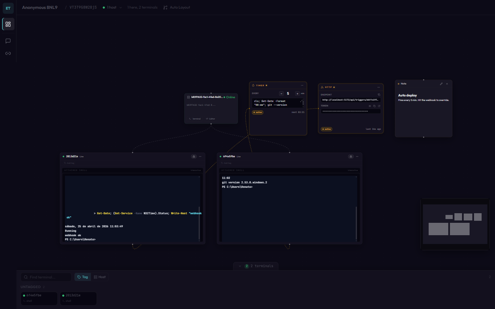

# Excaliterm

Collaborative terminals on an infinite canvas. Run an AI agent that supervises another terminal, pair-debug prod with a teammate, or stand up an on-call war room — all by workspace URL, no sign-up.

[excaliterm.com](https://excaliterm.com) | [npm](https://www.npmjs.com/package/excaliterm)

## Use cases

Excaliterm is built for moments where a single shared terminal isn't enough — when you need multiple shells across multiple machines visible at once, plus the people (or agents) operating them in the same view.

### 1. Run an AI coding agent with a human-in-the-loop supervisor

The headline pattern. You spawn two terminals on the same host: a **worker** running `claude` / `codex` / `aider` (or any custom CLI), and a plain **sidecar shell**. Your *supervisor* — your own MCP-enabled Claude Code or Claude Desktop — drives the worker with natural-language tool calls and uses the sidecar for `ls` / `git status` / filesystem recon on the same working tree. You watch the whole loop on the canvas: worker output, sidecar reads, trigger pulses when the supervisor sends a command.

The **+ Set up an agent** wizard in the toolbar provisions the worker, the sidecar, both HTTP triggers, the `mcp.json` config, and a per-CLI starter system prompt in about 30 seconds. See [§9](#9-let-an-agent-supervise-your-terminals).

### 2. Pair-debug prod or run an incident war room

Paste the workspace URL into Slack; teammates join by clicking the link. Everyone sees the same live shells in real time — terminal locks prevent fighting over the prompt, chat sits next to the commands, sticky notes capture decisions in place. Tag terminals by host or environment, drop them on the canvas, stream a monitor from any host at ~3 fps when you need the GUI not just the shell. Persistent across reloads — the workspace is your postmortem trail.

### 3. Teach or onboard remotely

Instructor types, learners watch live. Drop sticky notes with the next step right next to the terminal, open a file editor alongside the shell, switch between terminals with the dock. Learners join by URL — no install, no account on their end. Mobile-friendly, so a learner on the bus can follow along.

### 4. Automate the shell from cron, CI, or any webhook

Attach a **timer trigger** to a terminal to run a stored prompt every N minutes — with an "only when idle" gate so agentic loops (Ralph loop) don't inject `continue` mid-execution. Or attach an **HTTP trigger** to expose a signed webhook URL; calling it submits the prompt as if you typed it. cron-job.org → Excaliterm → your terminal, with a token rotation button when the URL leaks.

## Screenshots

### Desktop

Infinite canvas with live terminals, sticky notes, and a connected host:



### Mobile

Full mobile experience with hosts, terminals, notes, media, and chat:

<p>
  
</p>

Fullscreen terminal with a tactile virtual keyboard bar and a full Command Deck on the back of the card:

<p>
  
</p>

## Getting Started

### 1. Create a workspace

Go to [excaliterm.com](https://excaliterm.com) -- a workspace is created automatically. Copy the **workspace ID** from the URL (`/w/<id>`).

### 2. Connect a host

In the canvas toolbar, click **Connect a Host**. The dialog shows the full connection command with the workspace API key and hub URL pre-filled. Copy it.

### 3. Install the CLI

```bash
npm install -g excaliterm
```

Requires [Node.js](https://nodejs.org/) 20.12 or later.

### 4. Connect your machine

Paste the command from the "Connect a Host" dialog, or set the environment variables manually:

**Linux / macOS:**

```bash
export SIGNALR_HUB_URL="https://hub.excaliterm.com"
export SERVICE_API_KEY="<workspace API key>"
export WORKSPACE_ID="<workspace ID from URL>"
excaliterm
```

**Windows (PowerShell):**

```powershell
$env:SIGNALR_HUB_URL = "https://hub.excaliterm.com"
$env:SERVICE_API_KEY = "<workspace API key>"
$env:WORKSPACE_ID = "<workspace ID from URL>"
excaliterm
```

The API key is auto-generated per workspace. You can find it any time in the "Connect a Host" dialog.

Once the agent logs `Ready and waiting for commands`, the UI shows **"1 host ready"** -- your machine is connected.

### 5. Create terminals and editors

Click the **Terminal** or **Editor** button on the host node in the canvas. A live shell session or file editor appears on the canvas, linked to the host. Create as many as you need -- they arrange in a grid automatically. Tag terminals, filter by tag, drag them around, resize, and collaborate in real-time.

### 6. Find terminals with the dock

The **Terminal Dock** at the bottom of the canvas shows miniature skeleton cards for every terminal, grouped by **tag** or **host**. Use the search input to filter by ID or tag. Click a skeleton to pan to it on the canvas, or double-click to open fullscreen. On mobile, switch the terminal list grouping between status, tag, or host with the group toggle button. Swipe left/right in fullscreen to cycle between terminals.

### Mobile-specific features

On mobile (<=767px), the app switches to a dedicated mobile experience:

- **Hosts section** -- see connected hosts with status and quick-action buttons (new terminal, open editor)
- **Terminal cards with tag colors** -- colored left borders derived from the first tag for visual identification
- **Notes section** -- create and edit sticky notes with a fullscreen markdown editor
- **Chat as a full view** -- tap the Chat tab in the bottom nav for a full-screen chat experience
- **Virtual keyboard bar** -- two rows of 48px tactile keycaps: ESC, TAB, CTRL (latching modifier), `/`, Enter, hide-keyboard, plus arrow keys and page up/down scroll in the second row
- **Hide on-screen keyboard** -- dedicated keycap that blurs the focused input to dismiss the iOS/Android soft keyboard without leaving the terminal
- **Command Deck (back face)** -- tap the rotate icon to flip the card into a full-size hardware-style control surface: large D-pad, scroll column (top/page-up/page-down/bottom), oversized Esc/Tab/Enter action stack, latching Ctrl, modifier row (space, ~, |, -, _), symbol grid (/ \ : ; . , > <), tap-to-run recent commands, lock/unlock, dictate, hide-keyboard, and close
- **File editor** -- tap the editor button on any host card to open the file editor in a fullscreen overlay
- **Screenshots and streams** -- view captured screenshots and live screen shares in the media section

### Desktop-specific features

- **Auto Layout** -- click the "Auto Layout" button in the canvas toolbar to arrange all nodes in a top-down hierarchy using dagre graph layout
- **Split terminal view** -- in fullscreen terminal mode, click the split icon to view multiple terminals side-by-side (horizontal, vertical, or quad split) with terminal selector dropdowns per pane

### 7. View command history

Open the overflow menu on any terminal and select **Command History**. A linked history node appears on the canvas showing all commands entered in that terminal. Switch to the **Top 10** tab to see the most frequently used commands. Each command has **copy** and **execute** buttons -- execute re-sends the command to the terminal.

### 8. Automate with triggers

Open the overflow menu on any terminal and attach a trigger:
- **Timer** — fires a stored prompt every N minutes. Set the interval, type your prompt (or open the Monaco editor for longer scripts), toggle active. Optional "only when idle for Ns" gate skips firings while the terminal is busy (Ralph loop / agentic loop friendly).
- **HTTP** — exposes a public webhook URL. Calling it submits the prompt from the request payload to the terminal. Click the trigger node to copy the endpoint or the cURL example; rotate the secret if it leaks.

### 9. Let an agent supervise your terminals

The fastest path: click **+ Set up an agent → coding agent + sidecar shell** in the canvas toolbar. The wizard picks a host, spawns a worker terminal running your chosen CLI (`claude`, `codex`, `aider`, or custom) plus a plain shell on the same machine, attaches HTTP triggers, generates `~/.excaliterm/mcp.json`, runs an end-to-end connection test, and hands you a copy-paste system prompt — about 30 seconds end to end. Save the config on the supervisor machine and reload your MCP client.

The wizard sets up the canonical pattern: one terminal is the subordinate coding agent the supervisor instructs in natural language; the other is a plain bash shell on the same filesystem the supervisor uses for `ls`/`git status`/recon. No mixing the two — each MCP tool call goes to the right surface.

For workspaces that already have terminals you want to expose manually, **Connect an agent** stays available next to the wizard button.

See [docs/features/triggers.user.md](./docs/features/triggers.user.md#supervisor-pattern-claude-code-watching-another-terminal).

### 10. Share with others

Copy the workspace URL and send it to anyone. They join instantly as a collaborator -- no accounts needed.

## CLI Reference

| Environment Variable | Required | Default | Description |
|---|---|---|---|
| `SERVICE_API_KEY` | Yes | -- | Per-workspace API key (auto-generated, shown in "Connect a Host" dialog) |
| `SIGNALR_HUB_URL` | Yes | `http://localhost:5000` | SignalR hub URL from the service config |
| `WORKSPACE_ID` | Yes | -- | Workspace ID from the browser URL |
| `SHELL_OVERRIDE` | No | Auto-detected | Override the default shell (e.g. `/bin/zsh`, `bash.exe`) |
| `WHITELISTED_PATHS` | No | *(none)* | Comma-separated list of allowed filesystem roots. Empty = no filesystem access. Also settable via `--allow <path>` (repeatable) or positional args. |
| `SERVICE_ID` | No | `<hostname>-<pid>` | Custom identifier for this agent instance |

## Architecture

```text
+-----------+     REST      +-----------+     Redis      +-------------+
| Frontend  | <-----------> | Backend   | <-----------> | SignalR Hub |
| React/Vite|               | Hono/TS   |               | .NET 10     |
+-----------+               +-----------+               +-------------+
      ^                           ^                            ^
      | SignalR (/hubs/*)         | SQLite                     | SignalR
      |                           |                            |
      +---------------------------+----------------------------+
                                  |
                           +-------------+
                           | excaliterm  |
                           | CLI agent   |
                           | node-pty    |
                           +-------------+
```

## Stack

- Frontend: React 19, Vite 6, Tailwind CSS 4, `@xyflow/react`, xterm.js, dagre, TanStack Query, Zustand, SignalR
- Backend: Hono, TypeScript, Drizzle ORM, SQLite, Redis
- Realtime hub: ASP.NET Core SignalR on .NET 10 LTS
- Agent: Node.js, `node-pty`, SignalR client (`npm install -g excaliterm`)
- Tooling: pnpm workspaces, Turborepo, Docker Compose

## Self-Hosting

### Docker

```bash
docker compose up --build -d
```

This starts four containers: Redis, Backend API, SignalR Hub, and Frontend. Open **http://localhost:5173** -- a workspace is created automatically. Then follow steps 2-6 above. The "Connect a Host" dialog in the UI provides the full connection command with the workspace API key pre-filled.

## Local Development

### Prerequisites

- Node.js 22+
- pnpm 10+
- .NET 10 SDK
- Redis 7+

### Install

```bash
pnpm install
cp .env.example .env
```

Set at least these values in `.env`:

- `DATABASE_URL`
- `FRONTEND_URL`
- `BACKEND_PORT`
- `REDIS_URL`
- `SIGNALR_HUB_URL`
- `INTERNAL_API_SECRET` — shared secret the hub uses to call the backend's
  internal `/api/validate-key` endpoint. Must be at least 32 characters.
  Generate one with `openssl rand -hex 32`.
- `TRUST_PROXY` — set to `true` only when the backend sits behind a trusted
  reverse proxy. Defaults to `false`, in which case the rate-limiter uses the
  TCP peer address (unspoofable) instead of `X-Forwarded-For`.

### Run

Start Redis first, then run the backend and frontend:

```bash
docker compose up redis -d
pnpm --filter @excaliterm/backend dev
pnpm --filter @excaliterm/frontend dev
```

Run the SignalR hub with Redis enabled. In PowerShell:

```powershell
$env:REDIS_ENABLED = "true"
$env:REDIS_CONNECTION_STRING = "localhost:6379"
dotnet run --project apps/signalr-hub/Excaliterm.Hub
```

Then:

1. Open `http://localhost:5173`.
2. The app creates or restores a workspace and redirects to `/w/<workspaceId>`.
3. Copy that workspace ID from the URL.
4. Start the terminal agent with `WORKSPACE_ID=<workspaceId>`.

PowerShell example:

```powershell
$env:WORKSPACE_ID = "<workspaceId>"
pnpm --filter @excaliterm/terminal-agent dev
```

Once your env is already configured, `pnpm dev` can be used to launch the JavaScript workspaces together. The .NET SignalR hub still runs separately.

### Tests

```bash
pnpm test
pnpm --filter @excaliterm/backend test
pnpm --filter @excaliterm/frontend test
dotnet build apps/signalr-hub/Excaliterm.Hub
```

## Agent Discovery

Excaliterm implements several standards for AI agent discoverability:

| Standard | Endpoint | Description |
|---|---|---|
| Sitemap | `/sitemap.xml` | Canonical URL listing |
| Robots | `/robots.txt` | Crawl policy with sitemap reference |
| API Catalog (RFC 9727) | `/.well-known/api-catalog` | `application/linkset+json` API discovery |
| MCP Server Card | `/.well-known/mcp/server-card.json` | Model Context Protocol server metadata |
| Agent Skills (v0.2.0) | `/.well-known/agent-skills/index.json` | Agent skills discovery index |
| Link Headers (RFC 8288) | All pages | `Link` response headers for agent discovery |
| Markdown for Agents | Homepage | `Accept: text/markdown` content negotiation |
| WebMCP | All pages | Browser-exposed tools via `navigator.modelContext` |

## Documentation

- [Features](./docs/features/README.md) — per-feature user and technical docs
- [Architecture](./docs/architecture.md)
- [Setup Guide](./docs/setup.md)
- [API Reference](./docs/api-reference.md)
- [SignalR Protocol](./docs/websocket-protocol.md)
- [Development Guide](./docs/development.md)
- [Terminal Agent Guide](./docs/windows-service.md)
- [Deployment](./docs/deployment.md)
- [Troubleshooting](./docs/troubleshooting.md)

## License

MIT
